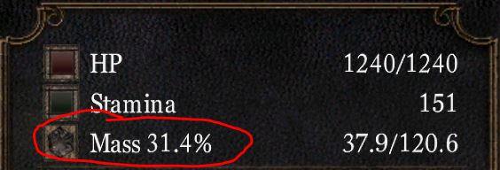

# EquipLoad% In-Game Display Mod

**EquipLoad%** is a lightweight, quality-of-life mod designed to display your equip load percentage directly in-game. It makes no gameplay changes, simply providing a convenient way to monitor your equip load status. This project is a **Work in Progress**, and I’m a beginner modder looking for help.

**Mentors, collaborators, or advice** on how to transform this mod from a Cheat Engine Table into a user-friendly, drag-and-drop DLL would be greatly appreciated. If you have experience with modding, C++, or DLLs, I’d love to hear from you!

## Features

The mod currently displays your equip load percentage in-game (labeled as "Mass ##.#%") using a Cheat Engine Table with a toggleable Lua script. My goal is to enhance it with **Color-coded ranges** for quick readability:
- **Light (0.0–25.0%)**: Green
- **Medium (25.1–60.0%)**: Yellow
- **Heavy (60.1–100.0%)**: Orange
- **Over Encumbered (100.1%+)**: Red

## Current State

The mod is functional but basic
  - Available as a **Cheat Engine Table (.CT file)** with a toggle.
  - Includes a standalone **.lua file** for convent viewing.
  - Early-stage **C++ script** for transitioning to a DLL [made mainly with AI] (needs significant work).

## How to Use (Use at Your Own Risk!)

1. **Download** the Cheat Engine Table (.CT file) the [Releases](https://github.com/A-Metal-Penguin/DS-PTDE_EquipLoadPercent/releases) page.
2. Install [**Cheat Engine**](https://github.com/cheat-engine/cheat-engine) if you haven’t already.
3. Load the .CT file in Cheat Engine and attach it to your game process.
4. Toggle the script on to display the equip load percentage in-game.

**Warning**: This is for PTDE ONLY. I do not have Remastered and do not know how these pointers will function. Also, this mod involves memory manipulation, which can be risky. Always back up your game files before use. I’ve tested it on my setup, but as a novice, I can’t guarantee it’s error-free. Use caution and report any issues!

## Project Goals & Help Needed

My ultimate goal is to convert this mod into a **drag-and-drop DLL** for a polished, user-friendly experience. However, I’m new to modding and C++, and I need guidance to make this happen. Here’s where I could use your expertise:
- **C++ Development**: Help me rewrite the Lua script into a proper C++ DLL. I’ve started a C++ script (included in the repo), but it’s rough and needs expert input.
- **Modding Advice**: Tips on injecting DLLs into the game safely and efficiently.
- **Testing & Feedback**: Try the mod and share bugs, suggestions, or improvements.

---

If you’re interested in collaborating, reviewing code, or sharing resources, please reach out!😄